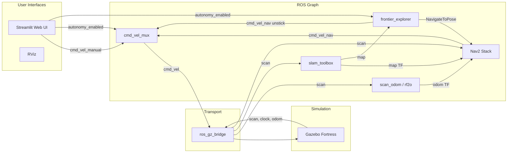

## minidog_sim architecture

### Design intent

- **Sandbox for autonomous exploration**: full SLAM + Nav2 + frontier exploration in simulation, reusable patterns for real hardware.
- **Autonomy-first**: the system starts exploring immediately; manual override available via web UI or topic.
- **Ackermann-aware**: the robot cannot rotate in place; all navigation, recovery behaviors, and the custom behavior tree account for this constraint.

### System overview

```
Gazebo Fortress (headless)
  |
  v
ros_gz_bridge  -->  /scan, /clock, /joint_states, /cmd_vel, /wheel_odom
  |
  +-- robot_state_publisher (URDF TF)
  +-- static_transform_publisher (base_footprint -> ouster)
  +-- minidog_scan_odom (wheel odom: odom->base_footprint TF)
  |
  +-- slam_toolbox (map->odom TF, /map)
  |
  +-- Nav2 (controller, planner, bt_navigator, behavior_server, lifecycle_manager)
  |     |-- reads /map, /scan, TF
  |     |-- publishes /cmd_vel_nav
  |     |-- uses custom Ackermann BT (no Spin recovery)
  |
  +-- minidog_frontier_explorer
  |     |-- reads /map, TF
  |     |-- sends NavigateToPose goals
  |     |-- clears costmaps on abort streaks
  |     |-- unstick mechanism (reverse cmd_vel)
  |
  +-- minidog_cmd_mux
  |     |-- /cmd_vel_manual + /cmd_vel_nav -> /cmd_vel
  |     |-- gated by /autonomy_enabled
  |
  +-- Streamlit web UI (port 8501)
```

### Staggered launch order

Race conditions between Gazebo, SLAM, and Nav2 are avoided with `TimerAction` delays in `bringup.launch.py`:

| Phase | Delay | Components |
|---|---|---|
| 1 | 0s | Gazebo, bridge, TF, odometry, mux, RViz |
| 2 | 5s | SLAM (`slam_toolbox`) |
| 3 | 10s | Nav2 servers (controller, planner, bt_navigator, behavior_server) |
| 3b | 15s | Nav2 lifecycle_manager (configures servers) |
| 4 | 20s | Frontier explorer, web UI |

### Commanding (manual vs autonomy)

`minidog_cmd_mux` multiplexes velocity commands:
- `/cmd_vel_manual` (manual joystick/web UI)
- `/cmd_vel_nav` (Nav2 output)
- `/cmd_vel` (final output to Gazebo)
- `/autonomy_enabled` (`Bool`): when true, forwards `/cmd_vel_nav`; when false, forwards `/cmd_vel_manual`

Both `cmd_vel_mux` and `frontier_explorer` start with `start_enabled: true` for auto-autonomy.

### Odometry

Three modes via `odom_source` launch argument:
- **`wheel`** (default in `run.sh`): `minidog_scan_odom` node reads Gazebo's wheel odometry from the bridge and publishes `minidog/odom -> minidog/base_footprint` TF. Most reliable in simulation.
- **`scan`**: `rf2o_laser_odometry` computes odom from lidar scan matching. Can drift.
- **`scan_matcher`**: external laser_scan_matcher node. Experimental.

### SLAM

`slam_toolbox` (async mode):
- Subscribes: `/scan`, TF
- Publishes: `/map`, `map -> minidog/odom` TF
- Key tuning: `throttle_scans: 5` (processes every 5th scan to reduce CPU load)
- Config: `config/slam_toolbox_async.yaml`

### Nav2

Individual lifecycle-managed nodes, configured via `config/nav2_slam.yaml`:

- **Planner**: `NavfnPlanner` with A*, tolerance 1.0, `allow_unknown: true`
- **Controller**: `RegulatedPurePursuitController`, 0.25 m/s, strict collision detection, reversing allowed
- **Behavior tree**: custom `nav2_bt_ackermann.xml` (no Spin recovery, uses ClearCostmap + Wait + BackUp)
- **Costmap inflation**: radius 0.25m (>= inscribed radius 0.225), cost_scaling_factor 3.0
- **Lifecycle manager**: 10s bond_timeout, delayed 5s after server nodes

### Frontier explorer

`minidog_frontier_explorer` (`frontier_explore.py`):

**Goal selection**:
1. Find frontier cells (free cells adjacent to unknown) in `/map`
2. Cluster via 8-connected BFS, discard clusters < 5 cells
3. For each cluster, sample cells and check safety (no occupied cell within 5-cell margin)
4. Pick the nearest safe, non-blocked cell to the robot (via TF lookup)

**Robustness mechanisms**:
- **Goal safety margin**: 5 cells (0.25m) clearance from occupied cells prevents goals near walls
- **Blocked goal list**: aborted/timed-out goals are blacklisted (1.5m radius, 90s TTL)
- **Costmap clearing**: after 3 consecutive aborts, calls `clear_entirely_*_costmap` services
- **Unstick mechanism**: after 6 consecutive aborts, publishes reverse `cmd_vel` for 4s then clears costmaps
- **Wall-time timeout**: goals stuck for 30s are canceled
- **Completion detection**: 15 consecutive ticks with no frontier cells triggers `EXPLORATION COMPLETE`

**Distinguishes "no frontiers" from "all blocked"**: when frontiers exist but all are blocked, the blacklist is cleared and costmaps refreshed instead of declaring completion.

### Simulation world

`minidog_world.sdf`: three 6x6m rooms connected by 1.5m doorways.
- Physics: 4ms step, 1x real-time factor
- Room 1: spawn room, no obstacles
- Room 2: east, one small box obstacle
- Room 3: south, one small cylinder obstacle

### DDS configuration

`config/fastdds_no_shm.xml` disables shared-memory transport (UDP only) to avoid WSL2 issues.

### Architecture diagram


