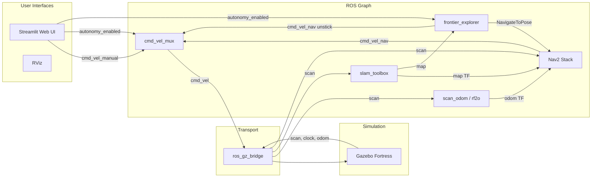

## minidog_sim architecture

### Design intent

- **Sandbox for autonomous exploration**: full SLAM + Nav2 + frontier exploration in simulation, reusable patterns for real hardware.
- **Autonomy-first**: the system starts exploring immediately; manual override available via web UI or topic.
- **Two robot models**: differential drive (`diffbot`, default — matches real GO2-W) and Ackermann (`minidog`, legacy). Diffbot supports spin recovery; Ackermann uses forward-only navigation.
- **Two data sources**: Gazebo simulation (`data_source:=sim`) or real robot rosbag replay (`data_source:=bag`).

### System overview

```
Gazebo Fortress (headless)
  |
  v
ros_gz_bridge  -->  /scan, /clock, /joint_states, /cmd_vel, /wheel_odom
  |
  +-- robot_state_publisher (URDF TF: base_footprint -> base_link -> wheels, lidar)
  +-- static_transform_publisher (base_footprint -> ouster sensor frame)
  +-- RF2O pipeline: scan_filter -> rf2o -> odom_stabilizer (odom->base_footprint TF, 20Hz)
  |   (or scan_odom in wheel/scan mode)
  |
  +-- slam_toolbox (map->odom TF, /map)
  |
  +-- Nav2 (controller, planner, bt_navigator, behavior_server, lifecycle_manager)
  |     |-- reads /map, /scan, TF
  |     |-- publishes /cmd_vel_nav
  |     |-- diffbot: BT with Spin recovery; ackermann: BT without Spin
  |
  +-- frontier_explorer
  |     |-- reads /map, TF (position + heading)
  |     |-- heading-aware goal scoring (forward-biased)
  |     |-- sends NavigateToPose goals (oriented toward goal)
  |     |-- immediate unstick on any abort (reverse + clear costmaps)
  |
  +-- minidog_cmd_mux
  |     |-- /cmd_vel_manual + /cmd_vel_nav -> /cmd_vel
  |     |-- gated by /autonomy_enabled
  |
  +-- Streamlit web UI (port 8501)
```

### Staggered launch order

Race conditions between Gazebo, SLAM, and Nav2 are avoided with `TimerAction` delays in `bringup.launch.py`:

| Phase | Delay | Components |
|---|---|---|
| 1 | 0s | Gazebo, bridge, TF, odometry, mux, RViz |
| 2 | 5s | SLAM (`slam_toolbox`) |
| 3 | 10s | Nav2 servers (controller, planner, bt_navigator, behavior_server) |
| 3b | 15s | Nav2 lifecycle_manager (configures servers) |
| 4 | 20s | Frontier explorer, web UI |

### Commanding (manual vs autonomy)

`minidog_cmd_mux` multiplexes velocity commands:
- `/cmd_vel_manual` (manual joystick/web UI)
- `/cmd_vel_nav` (Nav2 output)
- `/cmd_vel` (final output to Gazebo)
- `/autonomy_enabled` (`Bool`): when true, forwards `/cmd_vel_nav`; when false, forwards `/cmd_vel_manual`

Both `cmd_vel_mux` and `frontier_explorer` start with `start_enabled: true` for auto-autonomy.

### Odometry

Three modes via `odom_source` launch argument:

- **`rf2o`** (default): Laser-based odometry — best for both simulation and real hardware.
  Pipeline: `/scan` → `scan_safety_filter` → `/scan_safe` → `rf2o_laser_odometry` → `/odom_rf2o` → `odom_stabilizer` → `/odom` (20Hz) + TF `odom → base_footprint`.
  - `scan_safety_filter` drops scans with zero time increment to prevent RF2O div-by-zero (lesson #13)
  - `rf2o_laser_odometry` runs at 20Hz with `publish_tf: false` (TF delegated to stabilizer)
  - `odom_stabilizer` republishes at a fixed 20Hz timer rate, smoothing jitter. Forces z=0 in TF. Detects staleness (>0.5s) and stops publishing to let TF age naturally, preventing stale transforms from masking failures (lesson #12, #14)
- **`wheel`**: `minidog_scan_odom` node reads Gazebo's wheel odometry from the bridge and publishes `odom → base_footprint` TF. Publishes at Gazebo's physics rate (~50-80Hz) which can cause position jitter in RViz. Wheel odom is always available on `/wheel_odom` for debugging regardless of mode.
- **`scan`**: Identity `odom → base_footprint` TF; SLAM provides all localization. Experimental.
- **`scan_matcher`**: external laser_scan_matcher node. Experimental.

### SLAM

`slam_toolbox` (async mode):
- Subscribes: `/scan`, TF
- Publishes: `/map`, `map -> minidog/odom` TF
- Key tuning: `throttle_scans: 5` (processes every 5th scan to reduce CPU load)
- Config: `config/slam_toolbox_async.yaml`

### Nav2

Individual lifecycle-managed nodes, configured via `config/nav2_slam.yaml`:

- **Planner**: `NavfnPlanner` with A*, tolerance 1.0, `allow_unknown: true`
- **Controller**: `RegulatedPurePursuitController`, 0.25 m/s, strict collision detection, **forward-only** (`allow_reversing: false`)
- **Goal checker**: `xy_goal_tolerance: 0.60`, `yaw_goal_tolerance: 6.28` (full circle — Ackermann cannot rotate in place to match heading)
- **Behavior tree**: custom `nav2_bt_ackermann.xml` (no Spin recovery, uses ClearCostmap + Wait + BackUp 1.0m at 0.15 m/s)
- **Costmap inflation**: radius 0.25m (>= inscribed radius 0.225), cost_scaling_factor 3.0
- **Costmap update rates**: global 2.0 Hz publish 1.0 Hz, local 2.0 Hz publish 1.0 Hz
- **Lifecycle manager**: 10s bond_timeout, delayed 5s after server nodes

### Frontier explorer

`minidog_frontier_explorer` (`frontier_explore.py`):

**Goal selection** (heading-aware, forward-biased):
1. Find frontier cells (free cells adjacent to unknown) in `/map` (including map edges)
2. Cluster via 8-connected BFS, discard clusters < 5 cells
3. For each cluster, stride-sample cells and check safety (no occupied cell within 5-cell margin)
4. Score candidates: `(distance / sqrt(cluster_size)) * heading_penalty`
   - `heading_penalty = 1.0 + heading_weight * |angle_diff| / pi` (default `heading_weight: 2.0`)
   - Goals directly ahead: penalty 1.0x; to the side: 2.0x; behind: 3.0x
5. Pick the lowest-scoring (best) safe, non-blocked candidate
6. Set goal orientation toward the goal direction (tangential approach for Ackermann)

**Robustness mechanisms**:
- **Goal safety margin**: 5 cells (0.25m) clearance from occupied cells prevents goals near walls
- **Blocked goal list**: aborted/timed-out goals are blacklisted (1.5m radius, 90s TTL, ROS clock)
- **Immediate unstick**: on **any** abort, immediately reverses for 5s at 0.20 m/s, then clears costmaps. Nav2's BT already tried its own recovery (clear + wait + backup 1m); if the goal still failed, the robot is truly stuck.
- **Wall-time timeout**: goals stuck for 30s are canceled
- **Completion detection**: 8 consecutive ticks (~16s) with no frontier cells triggers `EXPLORATION COMPLETE`
- **All-blocked cycle limit**: if all frontiers are blocked for 3 consecutive clear-retry cycles, declares exploration complete (prevents infinite loops)

**Distinguishes "no frontiers" from "all blocked"**: when frontiers exist but all are blocked, the blacklist is cleared and costmaps refreshed instead of declaring completion. Uses ROS sim-time throughout (no wall-clock `time.time()`).

### Simulation world

`minidog_world.sdf`: three 6x6m rooms connected by 1.5m doorways.
- Physics: 4ms step, 1x real-time factor
- Room 1: spawn room, no obstacles
- Room 2: east, one small box obstacle
- Room 3: south, one small cylinder obstacle

### DDS configuration

`config/fastdds_no_shm.xml` disables shared-memory transport (UDP only) to avoid WSL2 issues.

### Architecture diagram


